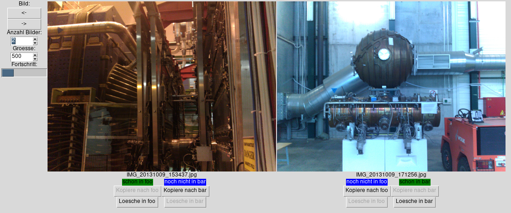

# Photobuch-Auswahltool

Graphical tool to help sorting images from a source into multiple target directories (UI currently German only).

Graphisches Programm, das helfen soll, Bilder aus einem Quellverzeichnis in mehrere Zielverzeichnisse zu sortieren.

# Idee

Alle Bilder aus einem Ordner werden angezeigt.
Dabei kann ausgewählt werden, wie viele davon gleichzeitig gezeigt werden und wie groß sie angezeigt werden sollen.
Damit hat man einen Überblick, welche Bilder es im Quellenverzeichnis gibt.
Für jedes einzelne Bild und jeden Ziel-Ordner kann man dann jeweils entscheiden, ob das Bild in den Ziel-Ordner kopiert ewrden soll.
Ebenso kann man die Bilder auch aus den Ziel-Ordnern löschen.
Farblich ist direkt hervorgehoben, ob das Bild im jeweiligen Ziel-Ordner vorhanden ist.

Die **Annahme** ist dabei, dass der Dateiname einmalig ist.
Der Inhalt der Bilder wird nicht verglichen.